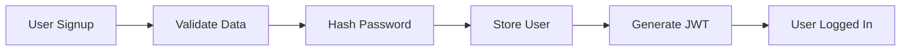
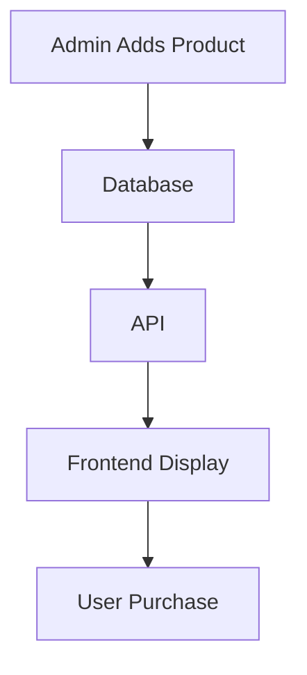
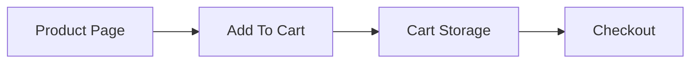
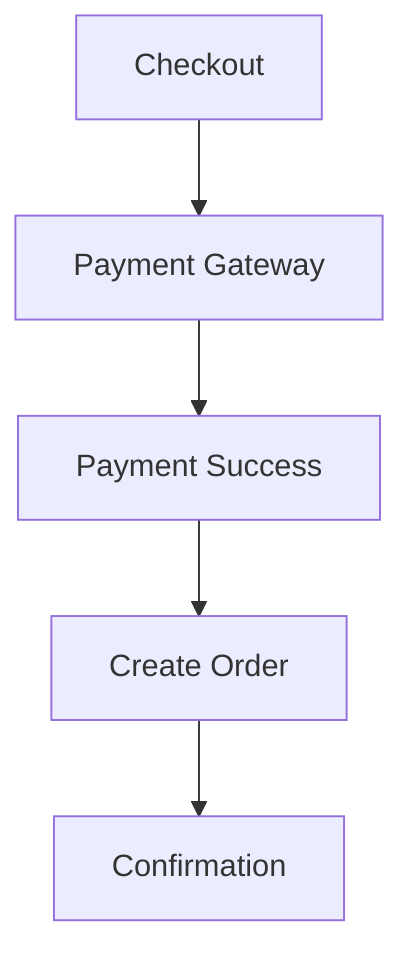
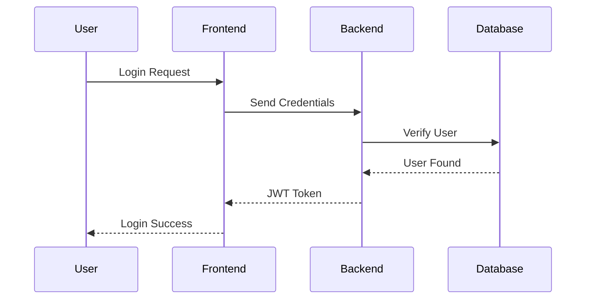

# 🛍️ E-Commerce Store

<div align="center">


### 🚀 Modern Full Stack E-Commerce Platform

Build your own online shopping experience with authentication, payments, admin dashboard, order tracking, and much more.

</div>

---

# 📌 Table of Contents

* [✨ Introduction](#-introduction)
* [🎯 Goals](#-goals)
* [🛠️ Tech Stack](#️-tech-stack)
* [📂 Project Structure](#-project-structure)
* [🔥 Features](#-features)
* [🧩 Modules](#-modules)
* [📸 UI Preview](#-ui-preview)
* [⚙️ Installation](#️-installation)
* [🚀 Running the Project](#-running-the-project)
* [🗄️ Database Design](#️-database-design)
* [🔐 Authentication Flow](#-authentication-flow)
* [💳 Payment System](#-payment-system)
* [📦 API Endpoints](#-api-endpoints)
* [📱 Future Improvements](#-future-improvements)
* [🤝 Contribution](#-contribution)
* [📜 License](#-license)
* [💡 Developer Notes](#-developer-notes)

---

# ✨ Introduction

This project is a complete **E-Commerce Store** designed for modern online shopping experiences. It includes everything needed to create a professional shopping platform:

✅ User Authentication
✅ Product Listings
✅ Shopping Cart
✅ Wishlist
✅ Secure Payments
✅ Order Management
✅ Admin Dashboard
✅ Mobile Responsive UI
✅ Real-Time Inventory Management

The goal is to build a scalable and production-ready e-commerce application.

---

# 🎯 Goals

### Main Objectives

* Create a fast and modern online store
* Learn full stack development
* Practice API integration
* Implement secure authentication
* Build scalable backend architecture
* Improve UI/UX design skills
* Learn deployment and DevOps basics

---

# 🛠️ Tech Stack

<div align="center">

| Frontend        | Backend       | Database      | Authentication | Deployment |
| --------------- | ------------- | ------------- | -------------- | ---------- |
| React.js ⚛️     | Node.js 🟢    | MongoDB 🍃    | JWT 🔐         | Vercel ▲   |
| Tailwind CSS 🎨 | Express.js 🚂 | MySQL 🐬      | OAuth 🔑       | Render 🚀  |
| Next.js ⚡       | REST API 🌐   | PostgreSQL 🐘 | Firebase 🔥    | Netlify 🌍 |

</div>

---

# 📂 Project Structure

```bash
Ecommerce-Store/
│
├── client/
│   ├── public/
│   ├── src/
│   │   ├── assets/
│   │   ├── components/
│   │   ├── pages/
│   │   ├── layouts/
│   │   ├── hooks/
│   │   ├── services/
│   │   ├── context/
│   │   └── utils/
│
├── server/
│   ├── config/
│   ├── controllers/
│   ├── middleware/
│   ├── models/
│   ├── routes/
│   ├── services/
│   └── utils/
│
├── docs/
├── screenshots/
├── README.md
├── package.json
└── .env
```

---

# 🔥 Features

## 👤 User Features

* 📝 User Registration & Login
* 🔐 Secure Authentication
* 🛒 Add to Cart
* ❤️ Wishlist System
* 🔎 Product Search & Filters
* 📦 Order Tracking
* ⭐ Product Reviews & Ratings
* 💳 Secure Checkout
* 📱 Fully Responsive Design

---

## 🛍️ Product Features

* Product Categories
* Product Variants
* Discount System
* Product Gallery
* Related Products
* Featured Products
* Inventory Management
* Dynamic Pricing

---

## 👨‍💼 Admin Features

* Admin Dashboard
* Add/Edit/Delete Products
* Manage Users
* Manage Orders
* Sales Analytics
* Inventory Tracking
* Coupon Management
* Role-Based Access Control

---

# 🧩 Modules

## 1️⃣ Authentication Module

### Features

* Register User
* Login User
* Forgot Password
* Reset Password
* Email Verification
* JWT Authentication



---

## 2️⃣ Product Module

### Features

* Product Listing
* Product Search
* Category Filter
* Product Details Page
* Product Ratings



---

## 3️⃣ Cart Module

### Features

* Add to Cart
* Remove Item
* Update Quantity
* Save Cart
* Guest Cart Support



---

## 4️⃣ Payment Module

### Features

* Stripe Integration
* PayPal Integration
* COD Support
* Payment Verification
* Invoice Generation



---

## 5️⃣ Order Module

### Features

* Place Orders
* Track Orders
* Order History
* Delivery Status
* Return Requests

---

## 6️⃣ Admin Dashboard Module

### Features

* Analytics
* Revenue Graphs
* Product Management
* User Management
* Order Monitoring

---

# 📸 UI Preview

## 🏠 Home Page

```text
 ------------------------------------------------------
| LOGO | Home | Shop | Categories | Cart | Profile |
 ------------------------------------------------------
|                                                      |
|        BIG HERO BANNER / SALE SECTION                |
|                                                      |
 ------------------------------------------------------
| Featured Products                                    |
| [Product] [Product] [Product] [Product]              |
 ------------------------------------------------------
```

---

## 🛒 Cart Page

```text
 ------------------------------------------------------
| Product Name | Quantity | Price | Remove             |
 ------------------------------------------------------
| Shoes        |    2     | $120  |   ❌               |
| Jacket       |    1     | $80   |   ❌               |
 ------------------------------------------------------
| Total: $200                                       |
 ------------------------------------------------------
```

---

## 👨‍💼 Admin Dashboard

```text
 ------------------------------------------------------
| Dashboard | Products | Orders | Users | Analytics |
 ------------------------------------------------------
| Sales Today: $2,500                              |
| Total Orders: 120                                |
| Pending Deliveries: 15                           |
 ------------------------------------------------------
```

---

# ⚙️ Installation

## Clone Repository

```bash
git clone https://github.com/your-username/ecommerce-store.git
```

## Go To Project Folder

```bash
cd ecommerce-store
```

## Install Dependencies

```bash
npm install
```

---

# 🚀 Running the Project

## Start Frontend

```bash
cd client
npm run dev
```

## Start Backend

```bash
cd server
npm run server
```

---

# 🗄️ Database Design

## User Schema

```js
{
  name: String,
  email: String,
  password: String,
  role: String,
  createdAt: Date
}
```

## Product Schema

```js
{
  title: String,
  price: Number,
  category: String,
  stock: Number,
  image: String
}
```

## Order Schema

```js
{
  userId: String,
  products: Array,
  totalPrice: Number,
  status: String
}
```

---

# 🔐 Authentication Flow



---

# 💳 Payment System

### Supported Payments

* 💳 Credit/Debit Cards
* 🪙 PayPal
* 💵 Cash On Delivery
* 📲 Mobile Wallets

### Security

* SSL Encryption
* Secure Payment Gateway
* Protected User Data
* PCI Compliance Ready

---

# 📦 API Endpoints

## User Routes

```http
POST   /api/auth/register
POST   /api/auth/login
GET    /api/auth/profile
```

## Product Routes

```http
GET    /api/products
GET    /api/products/:id
POST   /api/products
PUT    /api/products/:id
DELETE /api/products/:id
```

## Order Routes

```http
POST   /api/orders
GET    /api/orders
GET    /api/orders/:id
```

---

# 📱 Future Improvements

* 📲 Mobile Application
* 🤖 AI Product Recommendations
* 🌍 Multi-Language Support
* 🧠 Smart Search System
* 🎁 Loyalty Rewards Program
* 📈 Advanced Analytics
* 🛵 Live Delivery Tracking
* 💬 Live Chat Support

---

# 🧪 Testing

## Frontend Testing

```bash
npm run test
```

## Backend Testing

```bash
npm run test:server
```

---

# ☁️ Deployment

## Frontend Deployment

* Vercel
* Netlify
* Firebase Hosting

## Backend Deployment

* Render
* Railway
* AWS EC2

## Database Hosting

* MongoDB Atlas
* Supabase
* PlanetScale

---

# 🤝 Contribution

Contributions are welcome.

## Steps

1. Fork the repository
2. Create a new branch
3. Make changes
4. Commit your changes
5. Push to GitHub
6. Open a Pull Request

---

# 📜 License

This project is licensed under the MIT License.

---

# 💡 Developer Notes

### Things To Remember

* Keep components reusable
* Use environment variables securely
* Write clean and maintainable code
* Optimize images and performance
* Keep API routes protected
* Follow REST API conventions

---

# 🌟 Support

If you like this project:

⭐ Star the repository
🍴 Fork the project
📢 Share it with others

---

# 👨‍💻 Author

## Your Name Here

* GitHub: [https://github.com/your-username](https://github.com/your-username)
* LinkedIn: [https://linkedin.com/in/your-profile](https://linkedin.com/in/your-profile)
* Portfolio: [https://yourportfolio.com](https://yourportfolio.com)

---

<div align="center">

# ❤️ Thank You For Visiting

### Happy Coding 🚀

</div>
